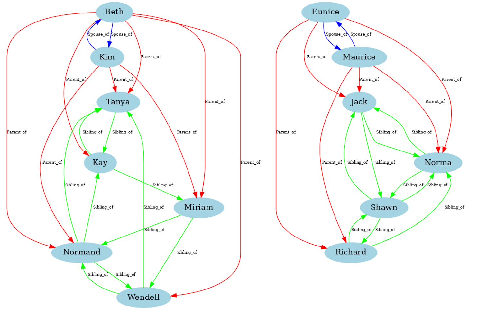
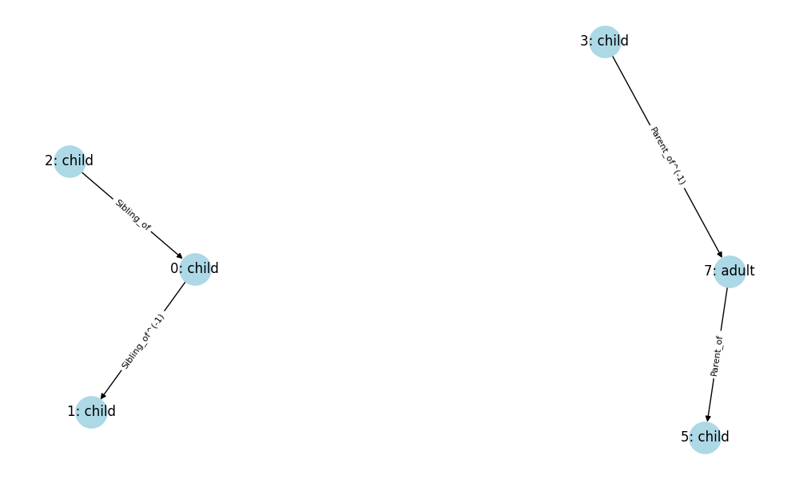
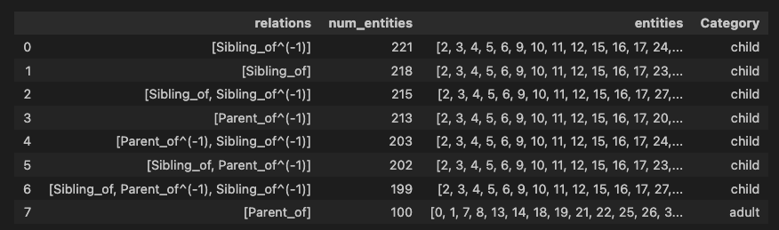

# RuleGraph

This repository implements the rule graph from ["Online Detection of Anomalies in Temporal Knowledge Graphs with Interpretability"](https://arxiv.org/pdf/2408.00872) for a static knowledge graph. It recreates Algorithm 1 to construct the rule graph, without using rule edges due to the absence of timestamps in static knowledge graphs.

## Requirements
```bash
conda install pytorch::pytorch torchvision torchaudio -c pytorch==2.4.1
pip install torch_geometric
pip install pyg_lib torch_scatter torch_sparse torch_cluster torch_spline_conv -f https://data.pyg.org/whl/torch-2.4.0+cpu.html
pip install spmf pandas datasketch matplotlib
```
To run the prefix span algorithm, we use the [SPMF software](https://www.philippe-fournier-viger.com/spmf/)
You need to download [JDK23](https://www.oracle.com/java/technologies/downloads/) to run the SPMF software.

## Creating the Rule Graph
Create the rule graph for a toy Family dataset by running `python main.py`. The constructed rule graph can be visualized in the notebook `Vizualize.ipynb`.

We have stored the constructed rule graph, so you can simply run the vizualization if you wish to without running the script.

The family dataset consists of isolated nuclear families (parents and their children, without grandparents, cousins, or uncles). It has three relations: `Parent_of`, `Sibling_of`, and `Spouse_of`.
<figure>
  
  <figcaption>Fig. 1: Examples from Family Dataset</figcaption>
  <a name="family"></a>
</figure>

The constructed Rule Graph looks as follows:

<figure>
  
  <figcaption>Fig. 2: Family Rule Graph</figcaption>
  <a name="Family_rule_graph"></a>
</figure>

The nodes are labeled in the format of `category_id: category`. Inverse edges are indicated with `^(-1)`. The constructed category functions are:

<figure>
  
  <figcaption>Fig. 3: Family Category Functions</figcaption>
  <a name="Family_Category_Functions"></a>
</figure>

Categories are classified as either `child` or `adult` based on their relation sets.
Categories with relations `Sibling_of`, `Sibling_of^(-1)`, `Parent_of^(-1)` imply a `child` category (`category_id 0 - 6`), while the category with `Parent_of` relation implies an `adult` category (`category_id 7`).

## Key Insights

### 1. Accurate Capture of Relation Semantics
The rule graph successfully captures the semantics of relations:
- `child` categories connect to other `child` categories via `Sibling_of` relations and their inverses.
- `child` categories connect to `adult` categories with `Parent_of^(-1)` relations.
- `adult` categories connect to `child` categories with `Parent_of` relations.

### 2. Limitations in Understanding Local Graph Structure
The algorithm doesn't consider the local graph structure around each entity when creating categories. Ideally, we'd want separate adult and child categories for each isolated family to understand that entities should only connect within the same family. This limitation arises because categories are defined solely by the outgoing relation set of an entity. Future work should consider both relation sets and local graph structure in category construction.

### 3. Potential Relation Dropping
The algorithm may drop relations deemed redundant. In our example, the `Spouse_of` relation is omitted because `Parent_of` already covers all adult entities. This can be problematic for anomaly detection of triples involving dropped relations. We propose adding a safeguard to ensure all relations are represented in the selected categories.

## Thank You

Thank you for reading this far! We hope you found this implementation and analysis of the rule graph algorithm insightful. If you have any questions, suggestions, or would like to contribute, please feel free to open an issue or submit a pull request.
